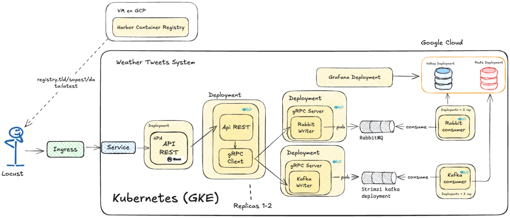
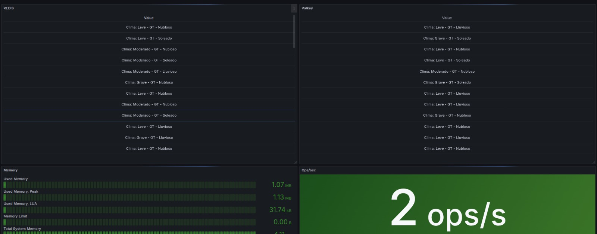
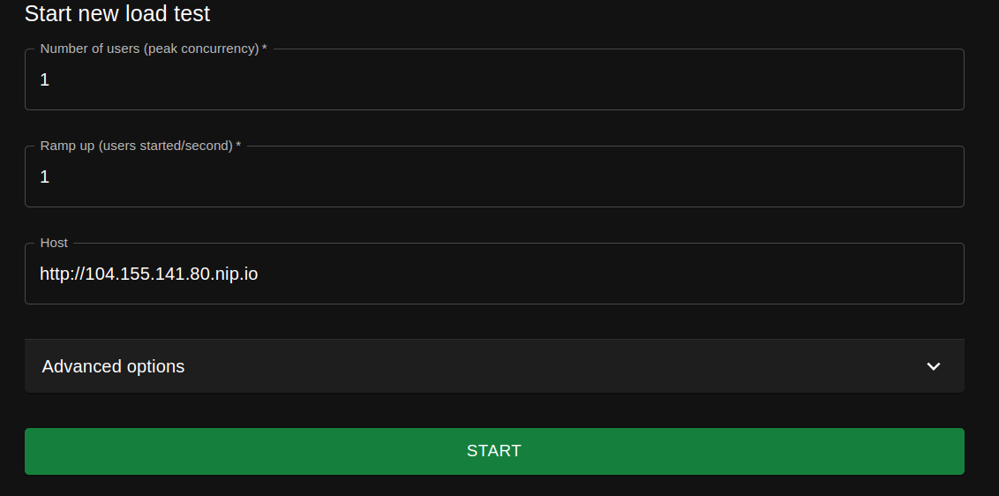

# <center> Proyecto 2- Tweets del Clima </center>

Este proyecto tiene como propósito aplicar los conocimientos adquiridos mediante la implementación de una arquitectura en Google Cloud Platform (GCP) utilizando Google Kubernetes Engine (GKE). El objetivo es construir una arquitectura de sistema distribuido genérico que muestre lostuits sobre el clima mundial. Esto se procesa mediante una arquitectura conceptual escalable. Este proyecto pretende mostrar la concurrencia de tuits en el sistema.

El proyecto consume datos meteorológicos desde una API REST, los reenvia a una API gRPC y los almacena usando Kafka y RabbitMQ en Redis y Valkey respectivamente, todo monitoreado en Grafana y con pruebas de carga desde Locust.


## 🏗️​ Arquitectura



## 🛠️ Componentes del Sistema

#### **API Rust**
- Reenvía las solicitudes a la API HTTP en Go.
- Expuesta por Ingress en `/input`.

#### **API Go HTTP**
- Recibe el JSON, lo envía por gRPC a la API gRPC.

#### **API Go gRPC**
- Publica el mensaje en **Kafka** y en **RabbitMQ**.

#### **Consumers**
- **Kafka Consumer**: almacena en Redis.
- **RabbitMQ Consumer**: almacena en Valkey.

#### **Redis y Valkey**
- Almacenamiento de mensajes por tipo de cola.

#### **Grafana**
- Dashboards para visualizar mensajes recibidos de Redis y Valkey.
- Se configuró el plugin `redis-datasource`.



#### **Ingress Controller**
- Gestiona el tráfico externo.
- Accesible desde: `http://<IP>.nip.io/input` y `http://<IP>.nip.io/grafana`.

##### 🌐 Explicación del Ingress (`ingress.yaml`)

El siguiente manifiesto Ingress se encarga de **exponer al exterior dos servicios internos del clúster**: la **API en Rust** y la interfaz de **Grafana**, utilizando un único dominio público (`nip.io`).

```yaml
apiVersion: networking.k8s.io/v1
kind: Ingress
metadata:
  name: weather-ingress
  namespace: ingress-nginx
  annotations:
    nginx.ingress.kubernetes.io/enable-rewrite-log: "true"
    nginx.ingress.kubernetes.io/force-ssl-redirect: "false"
spec:
  ingressClassName: nginx
  rules:
    - host: 104.155.141.80.nip.io
      http:
        paths:
          - path: /input
            pathType: Prefix
            backend:
              service:
                name: api-rust-service
                port:
                  number: 8080
          - path: /grafana
            pathType: Prefix
            backend:
              service:
                name: grafana
                port:
                  number: 3000
```

##### ✅ ¿Qué hace este Ingress?

- **`kind: Ingress`**: Declara un recurso que permite enrutar tráfico HTTP externo hacia servicios internos del clúster.
- **`host: 104.155.141.80.nip.io`**: Define el dominio que se usará para acceder. Gracias a `nip.io`, no hace falta configurar DNS manualmente.
- **`paths`**:
  - `/input`: Redirige las peticiones POST hacia el servicio `api-rust-service` (puerto 8080), es decir, a la API REST que recibe los datos del clima.
  - `/grafana`: Redirige las peticiones hacia el dashboard de Grafana (puerto 3000).
- **`annotations`**:
  - `enable-rewrite-log`: Activa el logeo de reglas de reescritura para depuración.
  - `force-ssl-redirect: false`: Permite que las conexiones HTTP funcionen sin forzar HTTPS (ideal en entornos de prueba/local).

---

##### 🌍 ¿Cómo funciona en la práctica?

- Cuando un usuario accede a `http://104.155.141.80.nip.io/input`, NGINX redirige internamente al servicio de Rust.
- Cuando accede a `http://104.155.141.80.nip.io/grafana`, ve la interfaz de Grafana con soporte completo para subrutas gracias a las variables `GF_SERVER_ROOT_URL` y `GF_SERVER_SERVE_FROM_SUB_PATH=true`.


#### **Harbor**
- Servidor de imágenes Docker auto hospedado en una VM en GCP.

---

## ☁️​ Despliegue en la Nube
#### 🔧 Entorno
- GCP: Google Kubernetes Engine (GKE).
- Helm: para Ingress.
- Certbot: para HTTPS en Harbor.

#### ⚙️ Recursos
- Cluster GKE de 3 nodos, 6 CPUs virtuales, 12 GB RAM.
- Límite de CPU y RAM configurado para cada pod.
- PV para persistencia de Grafana.

#### 📝 Comandos Utilizados (Los mismos se pueden aplicar para poner en marcha el proyecto)

- Construir imagenes de docker (Estar dentro de la carpeta de api_rust y api_go respectivamente):
    
        docker build -t api_rust:latest .
        docker build -f http/Dockerfile -t api_go_http:latest .
        docker build -f grpc/Dockerfile -t api_go_grpc:latest .
        docker build -f kafka_consumer/Dockerfile -t kafka_consumer:latest .
        docker build -f rabbitmq_consumer/Dockerfile -t rabbitmq_consumer:latest .

- Tag y push a las imágenes con la respectiva IP a la VM que contiene Harbor:

        docker tag api_rust:latest 34.69.137.65.nip.io/proyecto/api_rust:latest
        docker tag api_rust:latest 34.69.137.65.nip.io/proyecto/api_go_http:latest
        docker tag api_rust:latest 34.69.137.65.nip.io/proyecto/api_go_grpc:latest
        docker tag api_rust:latest 34.69.137.65.nip.io/proyecto/kafka_consumer:latest
        docker tag api_rust:latest 34.69.137.65.nip.io/proyecto/rabbitmq_consumer:latest
        docker push 34.69.137.65.nip.io/proyecto/api_rust:latest
        docker push 34.69.137.65.nip.io/proyecto/api_go_http:latest
        docker push 34.69.137.65.nip.io/proyecto/api_go_grpc:latest
        docker push 34.69.137.65.nip.io/proyecto/kafka_consumer:latest
        docker push 34.69.137.65.nip.io/proyecto/rabbitmq_consumer:latest

- Comandos utilizados en el cluster de Kubernetes:

        helm install ingress-nginx ingress-nginx/ingress-nginx -n ingress-nginx --create-namespace
        kubectl get pods -n ingress-nginx
        kubectl get svc -n ingress-nginx
        kubectl create -f https://strimzi.io/install/latest?namespace=ingress-nginx
        kubectl apply -f . -n ingress-nginx 
        kubectl get pods -n ingress-nginx
        kubectl get services -n ingress-nginx
---

## ​🐍​ Pruebas con Locust
- URL: `http://<IP>.nip.io/input`
- Se realizaron pruebas con 100 usuarios simultáneos.
- Resultados:
  - Respuestas exitosas.
  - Métricas estables sin caídas.


---

## ⚙️​ Consideraciones Técnicas
- Uso de `os.Getenv` para parametrización.
- Despliegue dividido en manifiestos `producción`.
- Uso de `ClusterIP` para todos los servicios internos.
- Uso de `nip.io` para exponer servicios sin configurar DNS.

---

## 📄 Deployments y Preguntas


### 📦 Descripción de Deployments

| Componente         | Tipo          | Réplicas | Namespace      | Imagen                                      |
|-------------------|---------------|----------|----------------|---------------------------------------------|
| API Rust          | Deployment    | 1        | ingress-nginx  | `api_rust`                                  |
| API Go HTTP       | Deployment    | 2        | ingress-nginx  | `api_go_http`                               |
| API Go gRPC       | Deployment    | 2        | ingress-nginx  | `api_go_grpc`                               |
| Kafka Consumer    | Deployment    | 2        | ingress-nginx  | `kafka_consumer`                            |
| RabbitMQ Consumer | Deployment    | 2        | ingress-nginx  | `rabbitmq_consumer`                         |
| Redis             | Deployment    | 2        | ingress-nginx  | `redis:7.2`                                 |
| Valkey            | Deployment    | 2        | ingress-nginx  | `valkey/valkey:7.2`                          |
| RabbitMQ          | StatefulSet   | 1        | ingress-nginx  | `rabbitmq:3-management`                     |
| Kafka             | Kafka (CRD)   | 2        | default         | Usando Strimzi Operator                     |
| Grafana           | Deployment    | 1        | ingress-nginx  | `grafana/grafana:10.2.3` (con PV persistente) |


### 📘 Explicaciones y Preguntas

#### 📌 ¿Cómo funciona Kafka?

Kafka es un sistema de mensajería distribuido basado en logs. Los productores envían mensajes a "topics", que están divididos en particiones. Los consumidores se suscriben a estos topics y leen los mensajes en orden. Kafka es altamente escalable y tolerante a fallos, lo que lo hace ideal para manejar grandes volúmenes de datos en tiempo real.

**Ejemplo**:
En este proyecto, la API gRPC publica mensajes del clima en un topic llamado `message`, y un consumidor en Go los extrae y guarda en Redis.

---

#### 📌 ¿Cómo difiere Valkey de Redis?

Valkey es un fork de Redis surgido después del cambio de licencia en Redis. Aunque actualmente son 100% compatibles, Valkey se centra en mantener una comunidad libre con licencia BSD y está empezando a agregar características nuevas propias.

**Ejemplo**:
Ambos se usaron en el proyecto: Redis para Kafka y Valkey para RabbitMQ, sin necesidad de cambiar código en los consumidores gracias a la compatibilidad.

---

#### 📌 ¿Es mejor gRPC que HTTP?

gRPC es más eficiente y rápido que HTTP en muchos contextos porque usa Protobuf (binario), lo cual reduce el tamaño de los mensajes y mejora la latencia. También permite comunicación bidireccional, streaming y definición de contratos estrictos (con .proto).

Sin embargo, HTTP es más simple, universal y fácil de consumir desde clientes web o herramientas como Postman.

**En este proyecto**:
- HTTP se usó para la API REST expuesta.
- gRPC se usó internamente para la lógica distribuida entre servicios.

---

#### 📌 ¿Hubo una mejora al utilizar dos réplicas en los deployments de API REST y gRPC? Justifique su respuesta.

✅ Sí, hubo una mejora notable en:
- **Disponibilidad**: Si una réplica falla, la otra sigue funcionando.
- **Balanceo de carga**: El Ingress y Kubernetes distribuyen las peticiones entre las réplicas.
- **Escalabilidad**: Con Locust se logró mantener rendimiento estable con múltiples usuarios concurrentes.

---

#### 📌 Para los consumidores, ¿Qué utilizó y por qué?

Se utilizó:

- **Go** como lenguaje de los consumidores.
- **Redis (para Kafka)**: Por eficiencia y compatibilidad con `segmentio/kafka-go`.
- **Valkey (para RabbitMQ)**: Como solución equivalente libre, compatible con Redis.

Esto permite visualizar métricas en Grafana desde ambas fuentes, diferenciando qué sistema de mensajería fue utilizado.

---